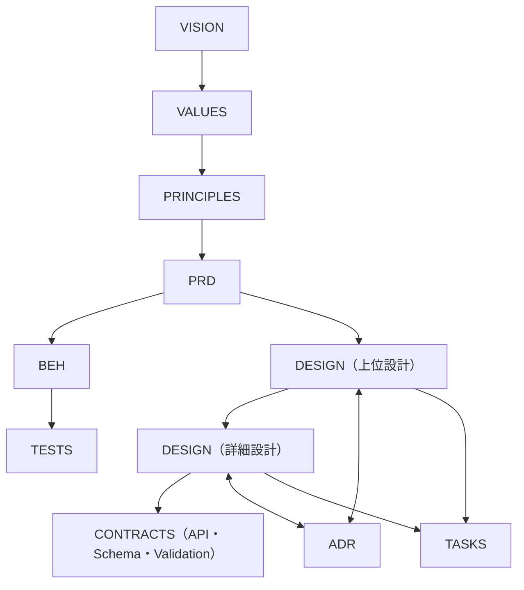

# Eutelo Documentation System Guide

このディレクトリは、**プロダクトの思考と実装の連続性を保つための「生きた設計書」** です。  
理念（Why）→ 要件（What）→ 体験（How）→ 設計 → 実装 → 検証  
までを1本の系でトレースできるよう設計されています。

---

## 目的

- チーム全員が同じ「目的」と「基準」で判断できるようにする。  
- 文書同士の依存関係を明示し、トレーサブルに保つ。  
- コード・テスト・UX仕様と常に整合した状態を維持する。  
- 変更が自動で文書・実装へ波及する仕組みを整える。

---

## ドキュメント階層の考え方

| 層 | 内容 | 主なファイル |
|----|------|---------------|
| **理念層** | Vision / Core Values / Principles | `docs/philosophy/` |
| **要件層** | 機能の目的・スコープ・成功基準 | `docs/product/features/{FEATURE}/PRD-*.md` |
| **体験層** | 振る舞い・UXシナリオ | `docs/product/features/{FEATURE}/BEH-*.md` |
| **設計層** | 構成・契約・依存・データ・非機能 | `docs/product/architecture/design/{FEATURE}/` |
| **判断層** | 設計上の意思決定・方針 | `docs/product/architecture/adr/` |
| **実装層** | 実装タスク・テスト・リリース | `docs/product/tasks/` , `docs/ops/` |

---

## ドキュメントライフサイクル

| フェーズ | 作業 | 成果物 |
|-----------|------|--------|
| **企画期** | Vision / Core Values / Principles | 理念文書 |
| **要件定義期** | PRD（メイン/サブ）作成・承認 | 目的・KPI・スコープ |
| **設計期** | BEH初稿・Design上位・ADR | UX仕様・設計方針 |
| **実装期** | Design詳細・契約・Tasks | 実装・テスト指針 |
| **運用期** | Runbook・Changelog更新 | 運用・改善サイクル |

---

## ルール（全体系に適用）

### 基本原則
- `purpose` は必須。本文全体の判断軸となる。  
- 親文書の `purpose` に矛盾しない。  
- すべての内容は **「目的 → 手段 → 成果」** の因果で構成する。  
- 文書内に **判断・仮説・比較検討** が含まれる場合は ADR に分離する。  
- 文書1つにつき1つの概念・目的に集中し、複数テーマを混在させない。  

### DocumentType拡張機能

Euteloは設定ファイル（`eutelo.config.*`）でカスタムドキュメント種別を定義できます。設定で定義されたDocumentTypeは自動的にCLIコマンドとして利用可能になり、`eutelo check`や`eutelo graph`でも認識されます。

詳細は `docs/product/features/EUTELO-CONFIG-DOC-TYPES/` を参照してください。  
- 目的が変わる場合は新しい文書を作成する。

---

### 構造・関係ルール
- サブ機能は **1階層まで**（再帰禁止）。  
- PRD ↔ BEH は **1:1対応**。  
- BEH ↔ TESTS は **1:1または1:多** を許容。  
- PRD ↔ DSG は **1:多**（上位/詳細）を許容。  
- DSG ↔ CONTRACTS は **1:多**（API / Schema / Validation / Events）を許容。  
- ADR ↔ DSG は **双方向**。設計判断は常に文書で根拠化する。  
- 各文書には `parent` または `related` を必ず指定する。  
- 廃止・非推奨文書には `status: deprecated` を設定し、削除はCIを経て行う。  
- ファイル命名・Frontmatter構成はディレクトリガイドに準拠する。

---

### ドキュメント作法
- 文章は「観察できる事実」か「目的に直結する意図」のみを書く。  
- 実装や一時メモは恒久ドキュメントに含めない。  
- 数値・指標・UI表現などは可能な限り定量化する。  
- 更新時には関連文書（PRD/BEH/DSG/ADR/Tasks）を同時に更新。  
- トーン・用語・粒度は統一する（例: PRD間で「ユーザー」「信徒」など用語不統一禁止）。  

---

### CI で担保するルール（自動検証対象）
- Frontmatter に必須キー（`id`, `type`, `purpose`, `last_updated`）が存在する。  
- `purpose` の整合性（LLM により親との矛盾を検出）。  
- ファイル命名が正規表現に合致している。  
- `parent` / `related` のリンク切れがない。  
- PRD ↔ BEH の1:1対応が崩れていない。  
- deprecated 文書が孤立していない。  

---

### 人的レビューで担保するルール
- 内容が `purpose` に従っており、手段が目的化していない。  
- 複数の目的が混在していない。  
- 上位文書と整合している（Vision → Principles → PRD → BEH → DSG）。  
- 用語・トーン・指標の粒度が他文書と一致している。  
- 変更時に影響範囲が明示され、関連ドキュメントが更新されている。  

---

### オプション（将来的にCI対応予定）
- 親より古い更新日はエラーとする。  
- 目的ツリー（Vision→Principles→PRD→BEH→DSG）に孤立ノードがない。  
- ADRのDecisionが設計（DSG）に未反映の場合に警告を出す。  
- ドキュメント依存グラフを自動生成して可視化。  

---

## ドキュメント間の関係モデル

> ADR は設計判断の根拠であり、DESIGN とは双方向に依存します。  
> 設計は上位 → 下位 → 契約へと派生し、最終的に Tasks と Test に分解されます。  

---

## ドキュメントのFrontmatter共通項目

| フィールド | 説明 | 例 |
|-------------|------|----|
| `id` | 一意の識別子 | `PRD-AUTH` |
| `type` | 文書種別 | `prd`, `behavior`, `design`, `adr`, `task` |
| `feature` | 機能名 | `AUTH`, `USER` |
| `subfeature` | サブ機能名 | `LOGIN`, `RESET` |
| `parent` | 親文書ID | `PRD-AUTH` |
| `related` | 関連文書ID群 | `[DSG-AUTH-LOGIN, ADR-001-token-expiry]` |
| `purpose` | この文書の目的 | テキスト |
| `status` | 状態 | `draft`, `active`, `deprecated` |
| `version` | バージョン番号 | `1.0.0` |
| `owners` | 担当者またはチーム | `["@team-auth"]` |
| `last_updated` | 最終更新日 | `"2025-11-11"` |

---

## 関連ガイドライン

- [ディレクトリ構成ガイド](./DIRECTORY_GUIDE.md)  
- [PRDガイドライン](./GUIDE_PRD.md)  
- [BEHAVIORガイドライン](./GUIDE_BEH.md)  
- [DESIGNガイドライン（任意追加）](./GUIDE_DSG.md)  
- [ADRガイドライン（任意追加）](./GUIDE_ADR.md)  
- [TASKガイドライン（任意追加）](./GUIDE_TASK.md)  

---

## まとめ

- すべての文書は **目的を起点** に整合しなければならない。  
- ドキュメントは設計図であり、コードと同等に扱う。  
- ADR による判断記録と CI による目的整合を組み合わせ、  
  **「破綻しない意思決定の履歴」** をプロジェクト全体で維持する。  

> **最終目的：**  
> 「思想から実装までが一貫して説明できるプロダクト体系」を作ること。