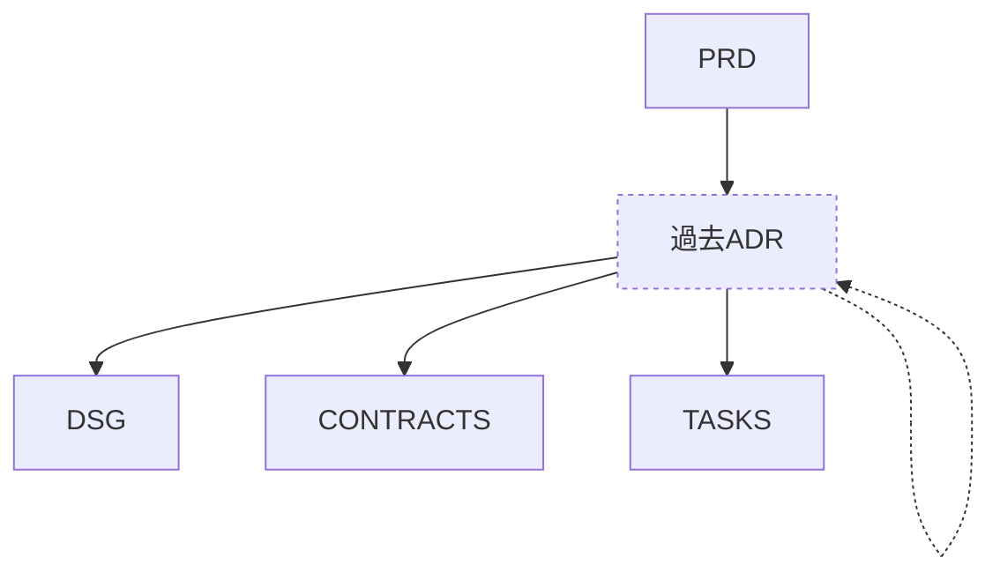

# 🧭 Architecture Decision Record (ADR) ガイド

このディレクトリは、設計・実装に関する **重要な意思決定の記録** を管理します。  
目的は、なぜ特定の方針を採用・却下したのかを明確にし、  
将来の判断やレビューを容易にすることです。

---

## 構成

```
adr/
  README.md
  _template-adr.md
  ADR-{SEQ}-{topic}.md
```

- `{SEQ}` は連番（ゼロパディング推奨：例 `0001`）  
- `{topic}` は英小文字・ハイフン区切りで概要を示す  

---

## ADRの目的と効用

| 観点 | 内容 |
|------|------|
| **記録** | なぜその決定をしたか、当時の前提・制約を残す |
| **共有** | チーム内で設計思想・判断理由を可視化する |
| **再利用** | 過去の判断を参照し、同様の検討を省力化する |
| **責務分離** | DSG（設計仕様）とPRD（要件）を結ぶ中間レイヤーとして、意思決定の透明性を保つ |

---

## 作成ルール

- 各ADRは **1つの意思決定にフォーカス** する。  
  - 複数テーマが混在する場合は分割する。
- ファイル名は `ADR-{SEQ}-{topic}.md` とし、トピックは短く簡潔に。  
- 必ず `status` を明示（`accepted` / `rejected` / `superseded` / `draft`）。  
- 関連する `PRD`, `DSG`, `CONTRACT`, `TASK` へのリンクを `frontmatter` に明記。  
- 新しい判断で旧ADRを置き換える場合は `supersedes` / `superseded_by` を使用。  
- 内容は過度に詳細にせず、**「なぜ・どう選んだか・何を棄却したか」** に集中する。  

---

## Frontmatter 共通仕様

```yaml
---
id: ADR-{SEQ}-{topic}
type: adr
title: {短い決定タイトル}
status: {draft|accepted|rejected|superseded}
deciders: ["@team-{FEATURE}", "@reviewers"]
date: "{DATE}"
supersedes: {ADR-ID?}
superseded_by: {ADR-ID?}
related: [{PRD-ID}, {DSG-ID}, {CONTRACT-ID}]
purpose: >
  （このADRの目的と背景）
---
```

---

## 推奨フォーマット

1. **Context**  
   - どのような問題・状況で検討が行われたか  
   - 関連するPRD/DSG/Contractの要約

2. **Decision**  
   - 採択した方針の内容  
   - なぜそれを選んだのか（理由・根拠）

3. **Consequences**  
   - この判断によって生じる影響・前提  
   - リスクやトレードオフがあれば明示  

4. **Alternatives Considered（任意）**  
   - 他に検討した選択肢と却下理由  

---

## ステータス運用ルール

| ステータス | 説明 |
|-------------|------|
| **draft** | 提案中、レビュー未完了 |
| **accepted** | 採択済み、有効な設計方針 |
| **rejected** | 検討されたが却下された案 |
| **superseded** | 新しいADRにより置き換え済み |

---

## 命名規則・例

| 種別 | 命名例 |
|------|--------|
| 採択済み | `ADR-0001-token-expiry-policy.md` |
| 却下 | `ADR-0002-rest-vs-graphql.md` |
| 置換済み | `ADR-0003-distributed-cache-superseded.md` |

---

## 関連関係（Mermaid）



---

> **目的:**  
> ADRは「設計判断のログ」であり、コードの背後にある意思を残すもの。  
> チームが将来同じ論点に直面したとき、再びゼロから悩まなくてよいようにする。