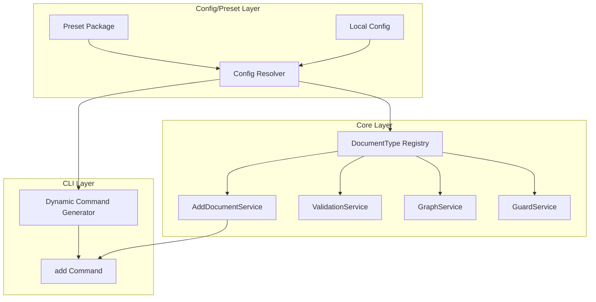

# DSG-EUTELO-CONFIG-DOC-TYPES

## Background

PRD-EUTELO-CONFIG-DOC-TYPES で定義された目的を実現するため、DocumentType を設定駆動化する設計を定義する。

現在の課題:
- `packages/core/src/services/AddDocumentService.ts` では `DocumentType` が `string` 型として定義されているが、CLI 側で `prd`, `beh`, `dsg` などの固定サブコマンドがハードコードされている
- 新種別を追加するには CLI コードの改修が必要
- Configurable Framework のゴール達成には、DocumentType を preset/config で自由に宣言し、コア・CLI が動的に参照する必要がある

## Goals

- DocumentType の一覧と属性（テンプレート・frontmatter schema 等）を config/preset に完全に委譲
- CLI コマンドを動的に生成する、または汎用コマンドで type を受け取る方式へ移行
- バリデーション／graph／guard が種別一覧を動的に読み取り、frontmatter schema / lint ルールを自動適用
- 既存 Dento プロジェクトとの後方互換性を維持

## Overview

### アーキテクチャ全体像



### 主要フロー

1. **Config 解決フロー**
   - ConfigResolver が preset とローカル設定をマージ
   - `scaffold` エントリから DocumentType 一覧を抽出
   - DocumentType Registry に登録

2. **CLI コマンド生成フロー**
   - Config 解決後に `scaffold` キーを走査
   - 各 `kind` に対応する CLI サブコマンドを動的に生成
   - または汎用 `eutelo add <type>` コマンドで type を引数として受け取る

3. **DocumentType 解決フロー**
   - AddDocumentService が `type` を受け取る
   - Config から `scaffold` エントリを検索（`kind` または `id` でマッチ）
   - 見つからない場合はエラー

4. **Validation/Graph/Guard フロー**
   - Config から `frontmatter.schemas` を取得
   - DocumentType ごとの schema を適用
   - 未登録種別に対しては警告またはエラー

## Structure

### 1. DocumentType Registry

**責務**: Config から解決された DocumentType の一覧とメタデータを管理

```typescript
interface DocumentTypeRegistry {
  /**
   * Config から解決された DocumentType の一覧を取得
   */
  getDocumentTypes(): string[];
  
  /**
   * 指定された DocumentType が登録されているか確認
   */
  hasDocumentType(type: string): boolean;
  
  /**
   * DocumentType に対応する ScaffoldTemplateConfig を取得
   */
  getScaffoldConfig(type: string): ScaffoldTemplateConfig | undefined;
  
  /**
   * DocumentType に対応する FrontmatterSchemaConfig を取得
   */
  getFrontmatterSchema(type: string): FrontmatterSchemaConfig | undefined;
}
```

**実装方針**:
- ConfigResolver が解決した `EuteloConfigResolved` から DocumentType 一覧を抽出
- `scaffold` エントリの `kind` を DocumentType として扱う
- インメモリキャッシュで高速化

### 2. CLI コマンド動的生成

**責務**: Config に基づいて CLI サブコマンドを動的に生成

**方式A: 動的サブコマンド生成**
```typescript
// Config 解決後に scaffold エントリを走査
for (const [id, scaffold] of Object.entries(config.scaffold)) {
  add
    .command(`${scaffold.kind} <feature>`)
    .description(`Generate a ${scaffold.kind.toUpperCase()} document`)
    .action(async (feature: string) => {
      // ...
    });
}
```

**方式B: 汎用コマンド + 引数**
```typescript
add
  .command('<type> <feature>')
  .description('Generate a document from template')
  .action(async (type: string, feature: string) => {
    // DocumentTypeRegistry で type を検証
    if (!registry.hasDocumentType(type)) {
      throw new Error(`Unknown document type: ${type}`);
    }
    // ...
  });
```

**推奨**: 後方互換性を考慮し、方式A（動的サブコマンド生成）を採用。既存の `eutelo add prd <feature>` 形式を維持。

### 3. AddDocumentService の変更

**現状**: `DocumentType` は `string` 型として定義されているが、CLI 側で固定コマンドが存在

**変更後**:
- `getBlueprint()` メソッドで Config から `scaffold` エントリを検索
- `kind` または `scaffoldId` でマッチング
- 見つからない場合は `DocumentTypeNotFoundError` をスロー

```typescript
private getBlueprint({ type, scaffoldId }: { type?: DocumentType; scaffoldId?: string }): DocumentBlueprint {
  const config = this.configResolver.getResolvedConfig();
  
  // scaffoldId が指定されている場合は id で検索
  if (scaffoldId) {
    const scaffold = config.scaffold?.[scaffoldId];
    if (!scaffold) {
      throw new DocumentTypeNotFoundError(`Scaffold ID not found: ${scaffoldId}`);
    }
    return this.buildBlueprint(scaffold);
  }
  
  // type が指定されている場合は kind で検索
  if (type) {
    const scaffold = Object.values(config.scaffold ?? {}).find(s => s.kind === type);
    if (!scaffold) {
      throw new DocumentTypeNotFoundError(`Document type not found: ${type}`);
    }
    return this.buildBlueprint(scaffold);
  }
  
  throw new Error('Either type or scaffoldId must be provided');
}
```

### 4. ValidationService の変更

**現状**: `frontmatter.schemas` から DocumentType ごとの schema を取得しているが、未登録種別の扱いが不明確

**変更後**:
- Config から解決された DocumentType のみを許可
- 未登録種別に対しては警告またはエラーを出力
- `frontmatter.schemas` に存在しない DocumentType は警告のみ（後方互換のため）

### 5. GraphService の変更

**現状**: DocumentType を動的に判定しているが、Config との整合性チェックがない

**変更後**:
- Config から解決された DocumentType のみを Graph に含める
- 未登録種別のドキュメントは警告として記録

### 6. GuardService の変更

**現状**: Config から `guard.prompts` を取得しているが、DocumentType との関連付けが不明確

**変更後**:
- DocumentType ごとの Guard プロンプト設定をサポート（将来拡張）
- 現状は既存の `checkId` ベースの方式を維持

## Contracts

### DocumentTypeNotFoundError

```typescript
export class DocumentTypeNotFoundError extends Error {
  constructor(
    public readonly documentType: string,
    public readonly availableTypes: string[]
  ) {
    super(`Document type '${documentType}' not found. Available types: ${availableTypes.join(', ')}`);
    this.name = 'DocumentTypeNotFoundError';
  }
}
```

### DocumentTypeRegistry Interface

```typescript
export interface DocumentTypeRegistry {
  getDocumentTypes(): string[];
  hasDocumentType(type: string): boolean;
  getScaffoldConfig(type: string): ScaffoldTemplateConfig | undefined;
  getFrontmatterSchema(type: string): FrontmatterSchemaConfig | undefined;
  getAllScaffoldConfigs(): Record<string, ScaffoldTemplateConfig>;
}
```

## Non-Functional Aspects

### パフォーマンス
- Config 解決はプロセス内でキャッシュ
- DocumentType Registry は Config 解決時に一度だけ構築
- CLI コマンド生成は起動時に一度だけ実行

### 拡張性
- 新種別追加は config/preset の定義のみで可能
- CLI コードの変更は不要
- テンプレートファイルの追加のみで対応可能

### 後方互換性
- 既存の `eutelo add prd <feature>` 形式を維持
- デフォルト preset を利用する既存ユーザーは変更不要
- 段階的な移行をサポート（警告→エラーの段階的移行）

### 型安全性
- Config から DocumentType を型推論（`keyof scaffold` の活用）
- TypeScript の型生成ツールで補完可能にする（将来拡張）

## Future Considerations

### CLI UI/UX の再設計
- サブコマンド vs 引数の選択はユーザーフィードバックに基づいて決定
- 補完機能の追加（`eutelo add <tab>` で利用可能な種別を表示）

### 型生成ツール
- Config から TypeScript の型定義を自動生成
- `DocumentType` の union 型を動的に生成

### Preset マーケットプレイス
- コミュニティが独自の DocumentType を定義した preset を共有
- Preset の検証・配布の仕組み

---

> **Note:**  
> 設計書は「仕様の再現性」を目的とする。  
> コードの実装方針は別途 `tasks/` や `ADR/` に委ねる。

