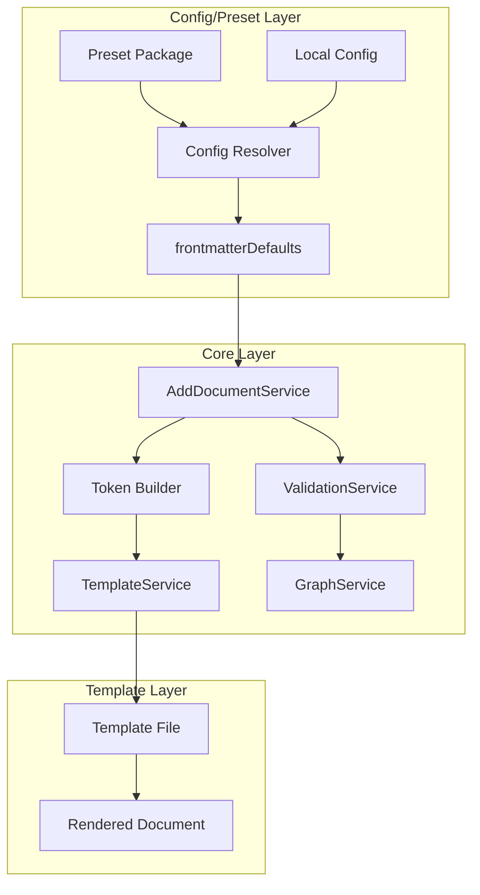

# DSG-EUTELO-CONFIG-FRONTMATTER-FIXED-VALUES

## Background

PRD-EUTELO-CONFIG-FRONTMATTER-FIXED-VALUES で定義された目的を実現するため、フロントマター内の実装上必須な固定値（`type` と `parent`）を scaffold 設定から自動的に注入する設計を定義する。

現在の課題:
- `packages/preset-default/templates/_template-*.md` 内で `type` と `parent` が固定値として記述されている
- `type` は `GraphNode.type` として必須であり、Graph作成時に使用される
- `parent` は `GraphNode.parentIds` として必須であり、Graphエッジ作成時に使用される
- `kind` と `type` の不一致（例: `kind: beh` だが `type: behavior`）が発生するリスクがある
- `parent` の設定忘れや誤設定によるGraph構造の破綻リスクがある

## Goals

- scaffold 設定に `frontmatterDefaults` を追加し、`type` と `parent` の必須フィールドを定義可能にする
- AddDocumentService が scaffold 設定から必須フィールドを自動注入する
- `kind` と `type` の整合性チェックを実装する
- 特定のkindに対して `parent` が設定されていない場合にエラーまたは警告を出す
- Graph作成時に必須フィールドが欠落しないことを保証する
- 既存のテンプレート変数との互換性を維持する

## Overview

### アーキテクチャ全体像



### 主要フロー

1. **Config 解決フロー**
   - ConfigResolver が preset とローカル設定をマージ
   - `scaffold` エントリから `frontmatterDefaults` を取得
   - `frontmatterDefaults.type` と `frontmatterDefaults.parent` を解決

2. **Token 構築フロー**
   - AddDocumentService が scaffold 設定から `frontmatterDefaults` を取得
   - `frontmatterDefaults.type` を `TYPE` トークンとして追加
   - `frontmatterDefaults.parent` をテンプレート変数として解決し、`PARENT` トークンとして追加
   - 既存のトークン（`ID`, `FEATURE`, `PARENT` など）とマージ

3. **テンプレートレンダリングフロー**
   - TemplateService がテンプレートファイルを読み込む
   - `{TYPE}` と `{PARENT}` プレースホルダーをトークンで置換
   - テンプレート内の固定値記述（`type: prd`, `parent: PRD-{FEATURE}` など）が上書きされる

4. **Validation フロー**
   - `kind` と `type` の整合性チェック
   - 特定のkindに対して `parent` が設定されているかチェック
   - rootParentIds に含まれる場合は `parent` チェックをスキップ

5. **Graph作成フロー**
   - GraphService が `type` を正常に取得することを保証
   - `parentIds` が空の場合、orphan nodeとして検出

## Structure

### 1. ScaffoldTemplateConfig の拡張

**責務**: scaffold 設定に `frontmatterDefaults` を追加し、必須フィールドを定義可能にする

```typescript
export interface ScaffoldTemplateConfig {
  id: string;
  kind: DocumentKind;
  path: string;
  template: string;
  variables?: Record<string, string>;
  frontmatterDefaults?: {
    type: string; // 必須: Graph作成時に使用される
    parent: string; // 必須: すべてのkindで必須。ルートドキュメントは '/' を設定。それ以外は親ドキュメントのIDを設定。テンプレート変数を使用可能
  };
}
```

**実装方針**:
- `frontmatterDefaults.type` は必須フィールドとして定義
- `frontmatterDefaults.parent` は必須フィールドとして定義（すべてのkindで必須）
  - 最も先祖のドキュメント（ルートドキュメント）は `parent: /` を設定する
  - それ以外のドキュメントは親ドキュメントのIDを設定する
  - テンプレート変数（`{PARENT}`, `{FEATURE}` など）を使用可能

### 2. AddDocumentService の変更

**現状**: `buildTokenMap()` で `ID` と `PARENT` トークンを構築しているが、`TYPE` トークンは存在しない

**変更後**:
- `frontmatterDefaults.type` を `TYPE` トークンとして追加
- `frontmatterDefaults.parent` をテンプレート変数として解決し、`PARENT` トークンとして追加（既存の `PARENT` トークンとマージ）
- `frontmatterDefaults` が設定されていない場合は既存の動作を維持（後方互換性）

```typescript
private buildTokenMap(context: DocumentContext, options: { includeDate: boolean }): Record<string, string> {
  const tokens: Record<string, string> = {
    FEATURE: context.feature ?? '',
    SUB: context.sub ?? '',
    NAME: context.name ?? '',
    SEQUENCE: context.sequence ?? ''
  };

  if (options.includeDate) {
    tokens.DATE = formatDate(new Date());
  }

  // frontmatterDefaults から type と parent を取得
  const blueprint = this.getBlueprint({ type: context.kind });
  const frontmatterDefaults = blueprint.scaffold.frontmatterDefaults;
  
  if (frontmatterDefaults?.type) {
    tokens.TYPE = frontmatterDefaults.type;
  }
  
  if (frontmatterDefaults?.parent) {
    // テンプレート変数を解決
    const resolvedParent = this.resolveTemplateVariable(frontmatterDefaults.parent, tokens);
    tokens.PARENT = resolvedParent;
  }

  return tokens;
}
```

### 3. TemplateService の変更

**現状**: `applyVariables()` で `{KEY}` 形式のプレースホルダーを置換している

**変更後**:
- `{TYPE}` プレースホルダーをサポート
- テンプレート内の固定値記述（`type: prd`, `parent: PRD-{FEATURE}` など）を上書きするロジックを追加

**実装方針**:
- テンプレートレンダリング後に、frontmatter セクションを解析
- `type` と `parent` フィールドが存在する場合、`frontmatterDefaults` の値で上書き
- YAML パーサーを使用して frontmatter を解析・更新

```typescript
private applyFrontmatterDefaults(
  content: string,
  frontmatterDefaults: { type?: string; parent?: string }
): string {
  if (!frontmatterDefaults.type && !frontmatterDefaults.parent) {
    return content;
  }

  // frontmatter セクションを抽出
  const frontmatterMatch = content.match(/^---\n([\s\S]*?)\n---/);
  if (!frontmatterMatch) {
    return content;
  }

  const frontmatterContent = frontmatterMatch[1];
  const frontmatter = parseYaml(frontmatterContent);

  // frontmatterDefaults の値で上書き
  if (frontmatterDefaults.type) {
    frontmatter.type = frontmatterDefaults.type;
  }
  if (frontmatterDefaults.parent) {
    frontmatter.parent = frontmatterDefaults.parent;
  }

  // frontmatter を再構築
  const updatedFrontmatter = stringifyYaml(frontmatter);
  return content.replace(frontmatterMatch[0], `---\n${updatedFrontmatter}\n---`);
}
```

### 4. ValidationService の変更

**現状**: `getDefaultRequiredFields()` で特定のkindに対して `parent` が必須とされている

**変更後**:
- `kind` と `type` の整合性チェックを追加
- `frontmatterDefaults.type` と `kind` の一致を検証
- 特定のkindに対して `parent` が設定されているかチェック（rootParentIds に含まれる場合は除く）
- それ以外のkindに対して `parent` が設定されていない場合に警告を出す

```typescript
validateKindTypeConsistency(
  kind: DocumentKind,
  type: string,
  scaffoldConfig: ScaffoldTemplateConfig
): ValidationResult {
  const expectedType = scaffoldConfig.frontmatterDefaults?.type;
  if (expectedType && expectedType !== type) {
    return {
      valid: false,
      errors: [`kind '${kind}' and type '${type}' do not match. Expected type: '${expectedType}'`]
    };
  }
  return { valid: true, errors: [] };
}

validateParentRequirement(
  kind: DocumentKind,
  parent: string | undefined,
  scaffoldConfig: ScaffoldTemplateConfig
): ValidationResult {
  // parent は常に必須
  if (!parent) {
    return {
      valid: false,
      errors: [`parent is required for kind '${kind}'. Use '/' for root documents.`]
    };
  }
  
  // parent が '/' の場合はルートドキュメントとして扱う
  if (parent === '/') {
    return { valid: true, errors: [] };
  }
  
  // それ以外の場合は親参照の検証が必要（別の検証ロジックで実施）
  return { valid: true, errors: [] };
}
```

### 5. GraphService の変更

**現状**: `GraphBuilder.build()` で `document.type` を `GraphNode.type` に設定している

**変更後**:
- `type` が欠落しないことを保証するロジックを追加
- `parentIds` が空の場合、orphan nodeとして検出するロジックを追加

```typescript
build(documents: ScannedDocument[]): Graph {
  const nodes: GraphNode[] = [];
  const orphanNodes: string[] = [];

  for (const doc of documents) {
    if (!doc.type) {
      throw new Error(`Document ${doc.id} is missing required field 'type'`);
    }

    const node: GraphNode = {
      id: doc.id,
      type: doc.type,
      parentIds: doc.parentIds ?? [],
      // ...
    };

    nodes.push(node);

    // parent が '/' の場合はルートドキュメントとして扱い、orphan node ではない
    if (node.parentIds.length === 0) {
      orphanNodes.push(node.id);
    } else if (node.parentIds.length === 1 && node.parentIds[0] === '/') {
      // parent が '/' の場合は正常（ルートドキュメント）
      // orphan node として記録しない
    }
  }

  return {
    nodes,
    edges: this.buildEdges(nodes),
    integrity: this.computeIntegrity(nodes, orphanNodes)
  };
}
```

## Contracts

### FrontmatterDefaults Interface

```typescript
export interface FrontmatterDefaults {
  type: string; // 必須: Graph作成時に使用される
  parent: string; // 必須: すべてのkindで必須。ルートドキュメントは '/' を設定。それ以外は親ドキュメントのIDを設定。テンプレート変数を使用可能
}
```

### ScaffoldTemplateConfig Interface (拡張)

```typescript
export interface ScaffoldTemplateConfig {
  id: string;
  kind: DocumentKind;
  path: string;
  template: string;
  variables?: Record<string, string>;
  frontmatterDefaults?: FrontmatterDefaults;
}
```

### ValidationResult Interface

```typescript
export interface ValidationResult {
  valid: boolean;
  errors: string[];
  warnings?: string[];
}
```

## Non-Functional Aspects

### パフォーマンス
- frontmatter の解析・更新によるオーバーヘッドを最小限に抑える
- YAML パーサーのキャッシュを検討
- テンプレートレンダリングの最適化

### 拡張性
- 新種別を追加する際に、`frontmatterDefaults` の設定が容易であること
- テンプレート変数の優先順位を明確に定義する

### 後方互換性
- `frontmatterDefaults` が設定されていない場合でも既存の動作が維持される
- 既存のテンプレートが引き続き動作する
- 段階的な移行をサポートする

### 型安全性
- TypeScript の型定義を明確化
- `frontmatterDefaults` の型チェックを実装

## Future Considerations

### 動的な固定値の計算
- 現時点では静的な値のみをサポート
- 将来的には動的な計算（例: `type: {KIND}` から自動決定）を検討

### テンプレート変数の優先順位
- `frontmatterDefaults` と `variables` の優先順位を明確に定義
- 競合時の動作を明文化

### 既存テンプレートの自動マイグレーション
- 現時点では手動更新を想定
- 将来的には自動マイグレーションツールを検討

---

> **Note:**  
> 設計書は「仕様の再現性」を目的とする。  
> コードの実装方針は別途 `tasks/` や `ADR/` に委ねる。

