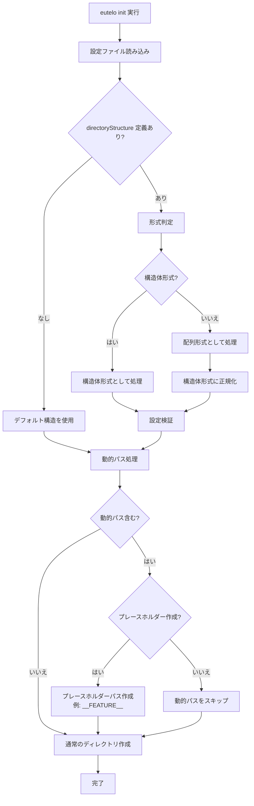

# DSG-EUTELO-CONFIG-INIT-DIRECTORY-STRUCTURE
Eutelo Init ディレクトリ構造カスタマイズ機能 設計仕様書

---

## Background

`PRD-EUTELO-CONFIG-INIT-DIRECTORY-STRUCTURE` と `ADR-EUTELO-CONFIG-INIT-DIRECTORY-STRUCTURE-0001` に基づき、
`eutelo init` コマンドで作成されるディレクトリ構造を設定ファイルでカスタマイズできる機能を実現する。

本設計では、設定スキーマの定義、設定ファイルの読み込み・検証ロジック、既存機能（ScaffoldService）との統合方法を明確にする。

---

## Goals

- 設定ファイルでディレクトリ構造を定義できるようにする
- ディレクトリごとのファイル定義形式と配列形式の両方をサポートする
- ディレクトリとファイルの関連性、テンプレート、ルール、変数などの情報をまとめて定義できるようにする
- 変数を含む動的パス（`{FEATURE}` など）を適切に処理する
- `scaffold` 設定との統合を容易にする
- 設定ファイルの検証を適切に実施する
- 既存機能との統合をスムーズに行う
- 後方互換性を維持する

---

## Overview

### 機能フロー



### 主要コンポーネント

1. **設定スキーマ定義**: `EuteloConfig` に `directoryStructure` を追加
2. **形式判定・正規化**: 配列形式を構造体形式に正規化
3. **設定検証**: パスの妥当性、テンプレート参照の整合性をチェック
4. **動的パス処理**: 変数を含むパス（`{FEATURE}` など）をプレースホルダーパスに変換
5. **ScaffoldService 統合**: 設定からディレクトリ構造を取得して使用

---

## Structure

### 1. 設定スキーマ定義

#### 1.1 型定義

```typescript
// packages/core/src/config/types.ts

// ディレクトリ配下のファイル定義
export interface DirectoryFileDefinition {
  file: string;  // ファイル名（プレースホルダー可: "PRD-{FEATURE}.md"）
  template?: string;  // テンプレートパス（オプション）
  rules?: string;  // ルールファイルパス（オプション）
  description?: string;  // ファイルの説明（オプション）
  prefix?: string;  // ファイル名のプレフィックス（オプション）
  variables?: string[];  // 使用される変数（オプション: ["FEATURE", "SUB"]）
  tags?: string[];  // タグ（オプション: ["prd", "feature"]）
}

// ディレクトリごとのファイル定義形式
export type DirectoryStructureMap = Record<string, DirectoryFileDefinition[]>;

// ディレクトリ構造の定義（配列形式またはディレクトリごとのファイル定義形式）
export type DirectoryStructure = 
  | string[][]  // 配列形式: [['product'], ['product', 'features'], ...]
  | DirectoryStructureMap;  // ディレクトリごとのファイル定義形式

// EuteloConfig への追加
export interface EuteloConfig {
  presets?: string[];
  docsRoot?: string;
  directoryStructure?: DirectoryStructure;  // 追加
  scaffold?: Record<string, ScaffoldTemplateConfig>;
  frontmatter?: {
    schemas?: FrontmatterSchemaConfig[];
    rootParentIds?: string[];
  };
  guard?: {
    prompts?: Record<string, GuardPromptConfig>;
  };
}
```

#### 1.2 正規化後の型

内部処理では、すべてディレクトリごとのファイル定義形式に正規化して扱う。

```typescript
// 正規化後の型（内部使用）
export type NormalizedDirectoryStructure = DirectoryStructureMap;
```

---

### 2. 設定ファイルの読み込み・検証

#### 2.1 形式判定

設定ファイルから `directoryStructure` を読み込んだ後、形式を判定する。

```typescript
function isArrayFormat(structure: DirectoryStructure): structure is string[][] {
  return Array.isArray(structure) && 
         structure.length > 0 && 
         Array.isArray(structure[0]) && 
         typeof structure[0][0] === 'string';
}

function isDirectoryStructureMap(
  structure: DirectoryStructure
): structure is DirectoryStructureMap {
  return typeof structure === 'object' && 
         !Array.isArray(structure) &&
         structure !== null;
}
```

#### 2.2 正規化処理

配列形式をディレクトリごとのファイル定義形式に正規化する。

```typescript
function normalizeDirectoryStructure(
  structure: DirectoryStructure,
  docsRoot: string
): NormalizedDirectoryStructure {
  if (isArrayFormat(structure)) {
    // 配列形式をディレクトリごとのファイル定義形式に正規化
    const normalized: DirectoryStructureMap = {};
    for (const path of structure) {
      const dirPath = path.length === 0 
        ? docsRoot 
        : path.join('/');
      normalized[dirPath] = [];  // 空のファイル定義配列
    }
    return normalized;
  }
  return structure;
}
```

#### 2.3 検証ロジック

設定の妥当性を検証する。

```typescript
function validateDirectoryStructure(
  structure: NormalizedDirectoryStructure,
  docsRoot: string,
  scaffold: Record<string, ScaffoldTemplateConfig>
): ValidationResult {
  const errors: string[] = [];
  const warnings: string[] = [];

  // 1. 空でないことを確認
  if (Object.keys(structure).length === 0) {
    errors.push('directoryStructure must contain at least one directory');
  }

  // 2. ルートディレクトリが含まれることを確認
  const hasRoot = docsRoot in structure || '' in structure;
  if (!hasRoot) {
    warnings.push(`directoryStructure should include root directory (${docsRoot})`);
  }

  // 3. 各ディレクトリの定義を検証
  for (const [dirPath, files] of Object.entries(structure)) {
    // 3.1 ディレクトリパスが相対パスであることを確認（変数は許可）
    const pathWithoutVars = dirPath.replace(/\{[A-Z0-9_-]+\}/g, 'PLACEHOLDER');
    if (pathWithoutVars.startsWith('/') || pathWithoutVars.includes('..')) {
      errors.push(`Directory path must be relative: ${dirPath}`);
      continue;
    }

    // 3.2 ファイル定義の配列が有効であることを確認
    if (!Array.isArray(files)) {
      errors.push(`Invalid file definitions for directory ${dirPath}: must be an array`);
      continue;
    }

    // 3.3 各ファイル定義を検証
    for (const fileDef of files) {
      // 3.3.1 必須フィールドの確認
      if (!fileDef.file || typeof fileDef.file !== 'string') {
        errors.push(`Invalid file definition in ${dirPath}: 'file' is required and must be a string`);
      }

      // 3.3.2 テンプレート参照の妥当性をチェック（オプション）
      if (fileDef.template) {
        // テンプレートファイルの存在確認は実装時に追加
      }

      // 3.3.3 ルール参照の妥当性をチェック（オプション）
      if (fileDef.rules) {
        // ルールファイルの存在確認は実装時に追加
      }

      // 3.3.4 変数の妥当性をチェック（オプション）
      if (fileDef.variables) {
        if (!Array.isArray(fileDef.variables)) {
          errors.push(`Invalid variables in ${dirPath}/${fileDef.file}: must be an array`);
        }
      }

      // 3.3.5 ディレクトリパスとファイル定義の変数の整合性をチェック
      const dirPathVars = extractVariables(dirPath);
      const fileVars = fileDef.variables || [];
      const filePathVars = extractVariables(fileDef.file);
      
      // ディレクトリパスに含まれる変数がファイル定義の変数に含まれているか確認
      for (const varName of dirPathVars) {
        if (!fileVars.includes(varName) && !filePathVars.includes(varName)) {
          warnings.push(
            `Variable ${varName} used in directory path ${dirPath} but not declared in file definition for ${fileDef.file}`
          );
        }
      }
    }
  }

  return { errors, warnings };
}

/**
 * パスから変数名を抽出する
 * 例: "docs/product/features/{FEATURE}" → ["FEATURE"]
 */
function extractVariables(path: string): string[] {
  const matches = path.matchAll(/\{([A-Z0-9_-]+)\}/g);
  return Array.from(matches, m => m[1]);
}
```

---

### 3. ScaffoldService との統合

#### 3.1 ディレクトリ構造の取得

`ScaffoldService` のコンストラクタで、設定ファイルからディレクトリ構造を取得する。

```typescript
// packages/core/src/services/ScaffoldService.ts

export interface ScaffoldServiceDependencies {
  fileSystemAdapter: FileSystemAdapter;
  logger?: Logger;
  templateService?: TemplateService;
  docsRoot?: string;
  scaffold?: Record<string, ScaffoldTemplateConfig>;
  directoryStructure?: DirectoryStructure;  // 追加
  dynamicPathOptions?: DynamicPathOptions;  // 追加
  clock?: () => Date;
}

export class ScaffoldService {
  private readonly requiredDirectories: readonly string[];

  constructor({
    fileSystemAdapter,
    logger = noopLogger,
    templateService,
    docsRoot = resolveDocsRoot(),
    scaffold,
    directoryStructure,  // 追加
    dynamicPathOptions,  // 追加
    clock = () => new Date()
  }: ScaffoldServiceDependencies) {
    // ...
    
    // ディレクトリ構造の取得
    if (directoryStructure) {
      const normalized = normalizeDirectoryStructure(directoryStructure, docsRoot);
      this.requiredDirectories = buildRequiredDirectoriesFromConfig(
        docsRoot, 
        normalized,
        dynamicPathOptions || { createPlaceholders: true }  // デフォルトでプレースホルダーを作成
      );
    } else {
      // デフォルト構造を使用
      this.requiredDirectories = buildRequiredDirectories(docsRoot);
    }
  }
}
```

#### 3.2 動的パスの処理

変数を含むパス（`{FEATURE}` など）を処理する。

```typescript
// packages/core/src/constants/requiredDirectories.ts

export interface DynamicPathOptions {
  createPlaceholders?: boolean;  // プレースホルダーパスを作成するか（デフォルト: true）
  placeholderPrefix?: string;    // プレースホルダーのプレフィックス（デフォルト: '__'）
  placeholderSuffix?: string;    // プレースホルダーのサフィックス（デフォルト: '__'）
}

/**
 * パス内の変数をプレースホルダーに変換する
 * 例: "docs/product/features/{FEATURE}" → "docs/product/features/__FEATURE__"
 */
function convertDynamicPathToPlaceholder(
  dirPath: string,
  options: DynamicPathOptions = {}
): string {
  const {
    createPlaceholders = true,
    placeholderPrefix = '__',
    placeholderSuffix = '__'
  } = options;

  if (!createPlaceholders) {
    return dirPath;  // プレースホルダーを作成しない場合はそのまま返す
  }

  // {VARIABLE} を __VARIABLE__ に変換
  return dirPath.replace(/\{([A-Z0-9_-]+)\}/g, (_, variable) => {
    return `${placeholderPrefix}${variable}${placeholderSuffix}`;
  });
}

/**
 * パスに変数が含まれているかチェック
 */
function hasDynamicSegments(dirPath: string): boolean {
  return /\{[A-Z0-9_-]+\}/.test(dirPath);
}
```

#### 3.3 ディレクトリ構造の構築

設定からディレクトリ構造を構築する関数。

```typescript
// packages/core/src/constants/requiredDirectories.ts

export function buildRequiredDirectoriesFromConfig(
  docsRoot: string,
  structure: NormalizedDirectoryStructure,
  options: DynamicPathOptions = {}
): readonly string[] {
  const directories = new Set<string>();
  
  // ルートディレクトリを追加
  directories.add(docsRoot);
  
  // 各ディレクトリパスを追加
  for (const dirPath of Object.keys(structure)) {
    if (dirPath === '' || dirPath === docsRoot) {
      continue;  // ルートディレクトリは既に追加済み
    }

    // 動的パスの処理
    let processedPath = dirPath;
    if (hasDynamicSegments(dirPath)) {
      processedPath = convertDynamicPathToPlaceholder(dirPath, options);
    }

    const absolutePath = path.isAbsolute(processedPath) 
      ? processedPath 
      : path.join(docsRoot, processedPath);
    directories.add(absolutePath);
  }
  
  return Array.from(directories).sort();
}
```

#### 3.3 `scaffold` 設定との統合

ディレクトリごとのファイル定義から `scaffold` 設定を生成する関数（オプション）。

```typescript
// packages/core/src/config/resolver.ts

export function generateScaffoldFromDirectoryStructure(
  structure: NormalizedDirectoryStructure,
  docsRoot: string
): Record<string, ScaffoldTemplateConfig> {
  const scaffold: Record<string, ScaffoldTemplateConfig> = {};
  
  for (const [dirPath, files] of Object.entries(structure)) {
    for (const fileDef of files) {
      // ファイル定義から scaffold エントリを生成
      // 実装詳細は後続で設計
    }
  }
  
  return scaffold;
}
```

---

### 4. 設定ファイルの読み込み統合

既存の `loadConfig` 関数に統合する。

```typescript
// packages/core/src/config/resolver.ts

function normalizeConfigFragment(raw: unknown, context: string): Partial<EuteloConfig> {
  // ...
  
  if (raw.directoryStructure !== undefined) {
    normalized.directoryStructure = normalizeDirectoryStructure(raw.directoryStructure, context);
  }
  
  // ...
}

function normalizeDirectoryStructure(
  value: unknown,
  context: string
): DirectoryStructure {
  // 配列形式またはオブジェクト形式のどちらかを許可
  if (!Array.isArray(value) && (typeof value !== 'object' || value === null)) {
    throw new ConfigValidationError(
      'directoryStructure must be an array or an object',
      context
    );
  }

  if (Array.isArray(value) && value.length === 0) {
    throw new ConfigValidationError(
      'directoryStructure must not be empty',
      context
    );
  }

  if (typeof value === 'object' && !Array.isArray(value) && Object.keys(value).length === 0) {
    throw new ConfigValidationError(
      'directoryStructure must not be empty',
      context
    );
  }

  // 形式判定と正規化は後続の処理で実施
  return value as DirectoryStructure;
}
```

### 5. CLI オプションの追加

`eutelo init` コマンドに動的パス処理のオプションを追加する。

```typescript
// packages/cli/src/index.ts

program
  .command('init')
  .description('Initialize the eutelo-docs structure in the current directory')
  .option('--dry-run', 'Show directories without writing to disk')
  .option('--config <path>', 'Path to eutelo.config.*')
  .option('--create-placeholders', 'Create placeholder directories for dynamic paths (default: true)')
  .option('--skip-dynamic-paths', 'Skip creating directories for dynamic paths')
  .option('--placeholder-format <format>', 'Placeholder format (default: __VARIABLE__)')
  .action(async (options: InitCliOptions = {}) => {
    // ...
    const dynamicPathOptions: DynamicPathOptions = {
      createPlaceholders: options.skipDynamicPaths 
        ? false 
        : (options.createPlaceholders ?? true),
      placeholderPrefix: options.placeholderFormat 
        ? extractPrefix(options.placeholderFormat) 
        : '__',
      placeholderSuffix: options.placeholderFormat 
        ? extractSuffix(options.placeholderFormat) 
        : '__'
    };
    
    const scaffoldService = createScaffoldService({
      fileSystemAdapter,
      templateService,
      docsRoot,
      scaffold: config.scaffold,
      directoryStructure: config.directoryStructure,
      dynamicPathOptions
    });
    // ...
  });
```

---

## Contracts

### 動的パスの処理

#### 動的パスの定義

ディレクトリパスに `{FEATURE}`, `{SUB}`, `{NAME}` などの変数が含まれる場合、そのパスは「動的パス」として扱われる。

例:
- `docs/product/features/{FEATURE}` → 動的パス
- `docs/architecture/adr` → 静的パス

#### プレースホルダーパスの作成

`eutelo init` 実行時、動的パスはプレースホルダーパスに変換されてディレクトリが作成される。

- 変換ルール: `{VARIABLE}` → `__VARIABLE__`
- 例: `docs/product/features/{FEATURE}` → `docs/product/features/__FEATURE__`

#### オプション

- `--create-placeholders` (デフォルト: true): プレースホルダーパスを作成する
- `--skip-dynamic-paths`: 動的パスをスキップする（プレースホルダーを作成しない）
- `--placeholder-format <format>`: プレースホルダーの形式を指定（デフォルト: `__VARIABLE__`）

#### 実際の値での置き換え

`eutelo add` コマンド実行時、プレースホルダーパスは実際の値で置き換えられる。

例:
- `eutelo add prd AUTH` 実行時
- `docs/product/features/__FEATURE__` → `docs/product/features/AUTH`

---

### 設定ファイルのスキーマ

#### JSON 形式の例（推奨）

```json
{
  "docsRoot": "docs",
  "directoryStructure": {
    "docs/product/features/{FEATURE}": [
      {
        "file": "PRD-{FEATURE}.md",
        "template": "templates/prd.md",
        "rules": "rules/prd.json",
        "description": "PRD ドキュメント",
        "prefix": "PRD-",
        "variables": ["FEATURE"],
        "tags": ["prd", "feature"]
      },
      {
        "file": "BEH-{FEATURE}.md",
        "template": "templates/beh.md",
        "rules": "rules/beh.json",
        "description": "BEH ドキュメント",
        "prefix": "BEH-",
        "variables": ["FEATURE"],
        "tags": ["beh", "feature"]
      }
    ],
    "docs/architecture/design/{FEATURE}": [
      {
        "file": "DSG-{FEATURE}.md",
        "template": "templates/dsg.md",
        "rules": "rules/dsg.json",
        "description": "DSG ドキュメント",
        "prefix": "DSG-",
        "variables": ["FEATURE"],
        "tags": ["dsg", "design"]
      }
    ],
    "docs/architecture/adr": [
      {
        "file": "ADR-{SEQ}-{topic}.md",
        "template": "templates/adr.md",
        "rules": "rules/adr.json",
        "description": "ADR ドキュメント",
        "prefix": "ADR-",
        "variables": ["SEQ", "topic"],
        "tags": ["adr", "architecture"]
      }
    ],
    "docs/tasks": [
      {
        "file": "TSK-{NAME}.md",
        "template": "templates/task.md",
        "rules": "rules/task.json",
        "description": "TASK ドキュメント",
        "prefix": "TSK-",
        "variables": ["NAME"],
        "tags": ["task"]
      }
    ],
    "docs/ops": [
      {
        "file": "runbook-{topic}.md",
        "template": "templates/ops.md",
        "rules": "rules/ops.json",
        "description": "OPS Runbook",
        "prefix": "runbook-",
        "variables": ["topic"],
        "tags": ["ops"]
      }
    ]
  }
}
```

#### YAML 形式の例

```yaml
docsRoot: docs
directoryStructure:
  docs/product/features/{FEATURE}:
    - file: PRD-{FEATURE}.md
      template: templates/prd.md
      rules: rules/prd.json
      description: PRD ドキュメント
      prefix: PRD-
      variables: [FEATURE]
      tags: [prd, feature]
    - file: BEH-{FEATURE}.md
      template: templates/beh.md
      rules: rules/beh.json
      description: BEH ドキュメント
      prefix: BEH-
      variables: [FEATURE]
      tags: [beh, feature]
  docs/architecture/design/{FEATURE}:
    - file: DSG-{FEATURE}.md
      template: templates/dsg.md
      rules: rules/dsg.json
      description: DSG ドキュメント
      prefix: DSG-
      variables: [FEATURE]
      tags: [dsg, design]
```

#### 配列形式（後方互換性）

```yaml
# 配列形式（後方互換性）
docsRoot: docs
directoryStructure:
  - []
  - [product]
  - [product, features]
  - [architecture]
  - [architecture, design]
  - [architecture, adr]
  - [tasks]
  - [ops]
```

#### TypeScript 形式の例

```typescript
// eutelo.config.ts
import { defineConfig } from '@eutelo/core/config';

export default defineConfig({
  docsRoot: 'docs',
  directoryStructure: {
    'docs/product/features/{FEATURE}': [
      {
        file: 'PRD-{FEATURE}.md',
        template: 'templates/prd.md',
        rules: 'rules/prd.json',
        description: 'PRD ドキュメント',
        prefix: 'PRD-',
        variables: ['FEATURE'],
        tags: ['prd', 'feature']
      },
      {
        file: 'BEH-{FEATURE}.md',
        template: 'templates/beh.md',
        rules: 'rules/beh.json',
        description: 'BEH ドキュメント',
        prefix: 'BEH-',
        variables: ['FEATURE'],
        tags: ['beh', 'feature']
      }
    ],
    'docs/architecture/design/{FEATURE}': [
      {
        file: 'DSG-{FEATURE}.md',
        template: 'templates/dsg.md',
        rules: 'rules/dsg.json',
        description: 'DSG ドキュメント',
        prefix: 'DSG-',
        variables: ['FEATURE'],
        tags: ['dsg', 'design']
      }
    ]
  }
});
```

---

## Non-Functional Aspects

### パフォーマンス

- 設定ファイルの読み込み・検証は `loadConfig` のキャッシュ機構を利用
- 形式判定と正規化は軽量な処理のため、パフォーマンスへの影響は最小限
- 設定検証は設定ファイル読み込み時に一度だけ実施
- 動的パスの処理（プレースホルダー変換）は軽量な文字列操作のため、パフォーマンスへの影響は最小限

### エラーハンドリング

- 無効な設定の場合は `ConfigError` をスロー
- エラーメッセージには、どの設定ファイルのどの部分で問題が発生したかを明示
- 警告は非致命的な問題（テンプレート参照の不一致など）に使用

### 拡張性

- 構造体形式により、将来的にメタデータ（説明、必須/任意など）を追加しやすい
- テンプレート参照の整合性チェックは、`scaffold` 設定との連携により実現

### 後方互換性

- 設定ファイルが存在しない、または `directoryStructure` が未指定の場合は、既存のデフォルト構造を使用
- 配列形式をサポートすることで、既存プロジェクトからの移行が容易
- 動的パスの処理はデフォルトでプレースホルダーを作成するが、オプション（`--skip-dynamic-paths`）で無効化可能

### 動的パスの処理

- **デフォルト動作**: 動的パスはプレースホルダーパス（`__FEATURE__` など）として作成される
- **オプション**: `--skip-dynamic-paths` で動的パスをスキップ可能
- **可視化**: プレースホルダーパスにより、どのディレクトリが動的に生成されるかが明確
- **置き換え**: `eutelo add` コマンド実行時に、実際の値で置き換えられる

---

## Future Considerations

- **メタデータの拡張**: ディレクトリ構造の定義に、必須/任意、説明、バージョンなどのメタデータを追加する可能性
- **preset との統合**: preset パッケージでディレクトリ構造を定義し、プロジェクト設定で上書きできるようにする
- **マイグレーションツール**: 配列形式から構造体形式への自動マイグレーション機能
- **設定ファイルの自動生成**: `eutelo config init` コマンドでデフォルト設定を生成する機能
- **動的パスの処理オプション**: CLI オプション（`--create-placeholders` / `--skip-dynamic-paths`）で動的パスの処理方法を選択できるようにする
- **プレースホルダーパスのカスタマイズ**: プレースホルダーの形式（`__FEATURE__` vs `{FEATURE}` など）を設定でカスタマイズできるようにする

---

## References

- `PRD-EUTELO-CONFIG-INIT-DIRECTORY-STRUCTURE`: 本機能の要件定義
- `ADR-EUTELO-CONFIG-INIT-DIRECTORY-STRUCTURE-0001`: 設定ファイル形式の決定
- `packages/core/src/constants/requiredDirectories.ts`: 既存の固定ディレクトリ構造
- `packages/core/src/services/ScaffoldService.ts`: 既存の ScaffoldService 実装
- `packages/core/src/config/types.ts`: 既存の設定ファイル型定義
- `packages/core/src/config/resolver.ts`: 既存の設定ファイル読み込み処理

