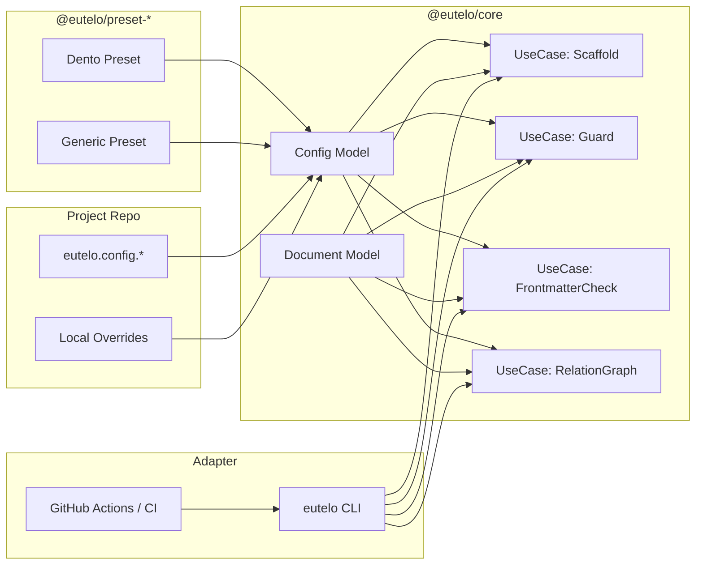

# 1. Design Goals

## 1.1 Primary Goals

- ディレクトリ構成・テンプレート・フロントマター・Guard プロンプトを **設定／プリセットとして外部化** する。
- Eutelo コアは、個別プロジェクトの作法に依存せず **抽象モデルとユースケースのみ** を担う。
- スキャフォールド / Guard / 静的解析 / Graph / CI は、**共通の設定モデル** に対して疎結合になる。
- 既存プロジェクト（Dento/Eutelo 自身）は、**デフォルト設定** により非互換なく移行できる。

## 1.2 Non-Goals / Out of Scope

- 設定編集用 GUI（Web UI・VSCode プラグインなど）の提供。
- プラグインマーケットプレイス等の大規模プラグイン機構。
- LLM モデル選択等の高度なオーケストレーション。

# 2. Architecture Overview

## 2.1 レイヤ構造

Eutelo の責務を以下の 3 レイヤに分割する。

1. **Core Layer (`@eutelo/core`)**
   - ドキュメント抽象モデル
   - フロントマタースキーマモデル
   - 設定モデル
   - 各ユースケースのインターフェイス（Scaffold / Guard / StaticCheck / Graph）

2. **Preset / Config Layer (`@eutelo/preset-*` + プロジェクトローカル設定)**
   - ディレクトリ構成・ファイル命名の定義
   - ドキュメント種別ごとのフロントマタースキーマ
   - Guard 用 LLM プロンプトテンプレート
   - 任意のプロジェクト固有ルール

3. **Adapter Layer**
   - CLI (`eutelo-cli`)
   - CI Integration（GitHub Actions 等）
   - Editor Integration（将来）

Core は「設定モデル」を前提とした純粋なユースケースのみを扱い、  
Preset / Config が世界観（Dento / Generic など）を注入し、  
Adapter が実行環境に接続する。

## 2.2 コンポーネント図（概念）



# 3. Configuration Model

## 3.1 設定ファイルの形式

優先順位の高い順に以下をサポートする。

- `eutelo.config.ts`（推奨）
- `eutelo.config.mts` / `eutelo.config.cjs` / `eutelo.config.js`
- `eutelo.config.yaml` / `eutelo.config.yml`
- `eutelo.config.json`

TypeScript 形式では `defineConfig` ヘルパを提供し、型安全な設定を可能にする。

```ts
// eutelo.config.ts
import { defineConfig } from "@eutelo/core/config";

export default defineConfig({
  presets: ["@eutelo/preset-generic"],
  scaffold: { /* ... */ },
  frontmatter: { /* ... */ },
  guard: { /* ... */ },
});
```

## 3.2 Config マージ戦略

Config は以下のレイヤでマージされる。

1. ライブラリ組み込みデフォルト（`@eutelo/preset-default`）
2. プロジェクトルート設定（`eutelo.config.*`）
3. 任意のローカルオーバーライド（将来的に `eutelo.local.config.*` 等）

マージルール:

- オブジェクトは「シャロー + 意味的なマージ」
  - `presets` は配列結合
  - `scaffold`, `frontmatter`, `guard` はキー単位で上書き
- 型破綻（例：string expected に object）はロード時にエラーとして報告。

## 3.3 型モデル（概略）

```ts
export type DocumentKind = "prd" | "beh" | "dsg" | "adr" | "task" | string;

export interface ScaffoldTemplateConfig {
  /** "feature.prd" など、論理的なキー */
  id: string;
  kind: DocumentKind;
  path: string; // e.g. "docs/product/features/{FEATURE}/PRD-{FEATURE}.md"
  template: string; // テンプレートファイルパス or パッケージ内 ID
  variables?: Record<string, string>; // { FEATURE: "AUTH" } のような解決キー
}

export interface FrontmatterFieldSchema {
  type: "string" | "number" | "boolean" | "array" | "enum" | "date";
  required?: boolean;
  enum?: string[];
}

export interface FrontmatterSchemaConfig {
  kind: DocumentKind;
  fields: Record<string, FrontmatterFieldSchema>;
}

export interface GuardPromptConfig {
  /** 用途: purpose 整合, parent 整合など */
  id: string;
  model?: string;
  temperature?: number;
  templatePath: string; // プロンプトテンプレートファイル
}

export interface EuteloConfig {
  presets?: string[]; // "@eutelo/preset-dento" など
  scaffold?: Record<string, ScaffoldTemplateConfig>;
  frontmatter?: {
    schemas: FrontmatterSchemaConfig[];
  };
  guard?: {
    prompts: Record<string, GuardPromptConfig>;
  };
}
```

Core はこの型にのみ依存し、実際の値は preset / プロジェクト設定から注入される。

# 4. Module Design

## 4.1 Config Resolver

### 4.1.1 責務

- 設定ファイル（および preset パッケージ）を集約し、`EuteloConfig` にマージして返す。
- CLI / Core UseCase の両方から利用される単一の入口。

### 4.1.2 主な API

```ts
interface ConfigResolver {
  loadConfig(options?: { cwd?: string }): Promise<EuteloConfigResolved>;
}

interface EuteloConfigResolved extends EuteloConfig {
  // 追加: 解決済みテンプレートパス・preset 展開済みなど
}
```

### 4.1.3 実装要点

- preset パッケージは `@eutelo/preset-*` のような命名規約で解決。
- それぞれが `export const euteloPreset: Partial<EuteloConfig>` を提供すると想定。
- キャッシュ:
  - プロセス内で複数回呼び出される場合、ファイル更新時までキャッシュを再利用。
  - `--no-cache` オプションで強制リロード可能。

## 4.2 Scaffold UseCase

### 4.2.1 責務

- 指定された論理キー（例: `feature.prd`）に対応する `ScaffoldTemplateConfig` を取得し、
  テンプレート展開・ファイル生成を行う。

### 4.2.2 フロー

1. ConfigResolver から設定取得。
2. CLI の引数、または API 引数から `id` / `variables` を受け取る。
3. `scaffold[id]` を検索。
4. `path` と `template` を解決し、テンプレートに変数を埋め込む。
5. ファイル生成（既存ファイルがある場合の挙動は `overwrite` オプションで制御）。

### 4.2.3 CLI 例

```bash
eutelo scaffold feature AUTH \
  --kind prd \
  --id feature.prd
```

## 4.3 Frontmatter Static Check UseCase

### 4.3.1 責務

- 対象ドキュメントの frontmatter をパースし、設定された schema に基づき静的検証する。

### 4.3.2 フロー

1. `Document` として対象ファイルを読み込み。
2. kind (`prd`, `beh`, ...) を判定（frontmatter の `type` を利用）。
3. ConfigResolver から `frontmatter.schemas` を取得。
4. 対応する schema を適用し、エラー／警告リストを返す。

### 4.3.3 出力モデル（例）

```ts
interface FrontmatterIssue {
  level: "error" | "warning";
  field: string;
  code: string; // e.g. "missing_required", "invalid_enum"
  message: string;
}

interface FrontmatterCheckResult {
  issues: FrontmatterIssue[];
}
```

## 4.4 Guard UseCase (LLM-based Consistency Check)

### 4.4.1 責務

- フロントマターと本文、関連ドキュメントなどを入力に、
  設定された Guard プロンプトを使って LLM に整合性チェックを依頼する。

### 4.4.2 フロー

1. ConfigResolver から `guard.prompts` を取得。
2. CLI or API によるチェック種別（例: `purposeConsistency`）を指定。
3. 対応する `GuardPromptConfig` を取得し、`templatePath` のテンプレートをロード。
4. ドキュメント・関連情報をテンプレートのプレースホルダに埋め込み、LLM に投げる。
5. LLM のレスポンスを `CheckResult` モデルにパースして返す。

### 4.4.3 考慮点

- テンプレートは preset 側で差し替え可能。
- Core は「テンプレートへの値埋め込み」と「レスポンスの構造化」のみを行う。

## 4.5 Relation Graph UseCase

### 4.5.1 責務

- frontmatter の `parent` / `tags` / `feature` などをもとに、
  ドキュメントの依存関係グラフを構築する。

### 4.5.2 Config との関係

- `frontmatter.schemas` 内で、関係性フィールドをマークできるようにする（例: `relation: "parent"`）。
- Graph UseCase は schema に従って関係フィールドを収集し、Graph を構成する。

# 5. CLI / CI Integration

## 5.1 CLI

CLI はすべて Core の UseCase を薄くラップする。

- 共通オプション
  - `--config` : 明示的に設定ファイルパスを指定
  - `--debug` : Config 解決経路と最終設定を表示
  - `--no-cache` : Config キャッシュ無効化

例:

```bash
# スキャフォールド
eutelo scaffold feature AUTH --kind prd

# Guard 実行
eutelo guard docs/product/features/AUTH/PRD-AUTH.md \
  --check purposeConsistency

# Frontmatter 静的チェック
eutelo frontmatter check docs/**/*.md
```

## 5.2 CI (GitHub Actions) での利用

GitHub Actions 用には、以下方針の薄いラッパーを提供する。

- `uses: eutelo/actions/guard@v1`
  - 内部で `eutelo guard` CLI を実行。
  - デフォルトで `eutelo.config.*` を読込み。
- CI 特有の設定（差分ファイル取得など）は Action 側の責務とし、Core には入れない。

# 6. Error Handling / DX

## 6.1 Config エラー

- 設定ファイル読み込みに失敗した場合：
  - ファイル未発見 → 明示的エラー（「デフォルト設定使用」か「失敗」とするかはフラグで制御）
  - シンタックスエラー → ファイルパスと行番号を含む詳細エラー
  - 型不一致 → `config validation` エラーとして表示

## 6.2 Debug 出力

`--debug` フラグで以下を表示できるようにする。

- 探索された config ファイルパス一覧
- 読み込まれた preset 一覧
- 最終的な `EuteloConfigResolved`（抜粋）  
  （LLM プロンプトなど機密性の高い文字列は省略／マスク）

# 7. Migration Strategy

## 7.1 現行実装からの移行ステップ

1. **ハードコーディングの棚卸し**
   - ディレクトリ構成、テンプレートパス、frontmatter schema、LLM プロンプトなどを列挙。
2. **デフォルト preset 化**
   - それらを `@eutelo/preset-default` として切り出し。
   - Core からは preset に依存するロジックを削除し、Config に依存する形へ書き換え。
3. **`eutelo.config.ts` の自動生成**
   - `eutelo config init` コマンドで、現行と同等のデフォルト設定を書き出す。
4. **CI / CLI 更新**
   - 既存の GitHub Actions / npm scripts を新 CLI に合わせて更新。
5. **別プロジェクトでの検証**
   - Dento 以外のミニプロジェクトを用意し、Generic preset + ローカル override で実運用する。

# 8. Open Points / Future Work

- Config の「部分オーバーライド」をどこまで許すか（複雑化リスク）。
- Guard プロンプトのカスタマイズ粒度（1 ファイル丸ごと vs セクション単位差し替え）。
- Preset 配布の標準パターン（`@org/eutelo-preset-*` 命名規約など）。

---

この DSG をベースに、

- Config モデルの型定義
- Config Resolver 実装
- 既存機能の Config 対応リファクタ

を順に TASK 化していく。