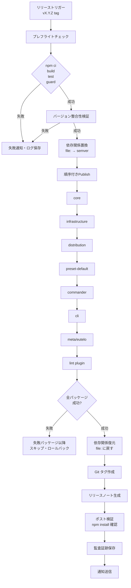

# DSG-EUTELO-RELEASE-FLOW

## Background
PRD-EUTELO-RELEASE-FLOW で定義された要件を実現するため、CI パイプラインを中心とした
自動リリースフローを設計する。手動操作を最小化し、SemVer 準拠・依存関係整合・provenance 署名を
保証する仕組みを構築する。

## Goals
- CI だけでリリース可能なワンパスフローを実現する
- すべての公開パッケージが provenance 付きで npm に到達する
- バージョン確定から publish 完了まで 60 分以内を達成する
- リリース失敗率 2% 未満を維持する
- changelog・Git タグ・リリースノートの自動生成を実現する

## Overview

リリースフローは以下の主要フェーズで構成される：

1. **トリガー検知**: Git タグでリリースジョブを起動
2. **プレフライト**: ビルド・テスト・guard チェックを実行し、ゲートを通過
3. **バージョン整合性検証**: SemVer 準拠と依存パッケージ間のバージョン整合を確認
4. **依存関係置換**: `file:` 依存を semver に一時置換
5. **順序付き公開**: 依存順序に従って各パッケージを publish
6. **リリースノート生成**: CHANGELOG と GitHub Release ノートを自動生成
7. **ポスト検証**: 公開後のインストール検証とメタパッケージ動作確認
8. **監査証跡**: 公開結果・provenance URL・通知を記録

## Structure

### 1. リリーストリガー検知モジュール
- **責務**: Git タグイベントを検知し、リリースジョブを起動
- **入力**: GitHub Actions イベント（`push` タグ）
- **出力**: リリース対象バージョン、パッケージリスト、dist-tag（`latest`/`next`）

### 2. プレフライト検証モジュール
- **責務**: リリース前の必須チェックを実行
- **実行順序**:
  1. `npm ci`（lockfile 固定）
  2. `npm run build`（全パッケージビルド）
  3. `npm test`（全テスト実行）
  4. `npx eutelo guard --ci --json --fail-on-error`（guard 検証）
- **失敗時**: リリースを中断し、エラー詳細を通知

### 3. バージョン整合性検証モジュール
- **責務**: SemVer 準拠と依存パッケージ間のバージョン整合を検証
- **検証項目**:
  - 全パッケージの `package.json` が SemVer 形式
  - 内部依存（`@eutelo/*`）のバージョンが一致
  - CHANGELOG のバージョンと `package.json` の一致
- **出力**: 検証結果レポート、不一致パッケージリスト

### 4. 依存関係置換モジュール
- **責務**: `file:` 依存を semver に一時置換し、publish 後に復元
- **処理フロー**:
  1. 全 `package.json` をスキャンし `file:` 依存を検出
  2. 対応する semver バージョンに置換（バックアップ保存）
  3. publish 完了後、バックアップから復元
- **ログ**: 置換前後の差分を記録

### 5. 順序付き公開モジュール
- **責務**: 依存順序に従って各パッケージを順次 publish
- **公開順序**:
  1. `@eutelo/core`
  2. `@eutelo/infrastructure`
  3. `@eutelo/distribution`
  4. `@eutelo/preset-default`
  5. `@eutelo/commander`
  6. `@eutelo/cli`
  7. `@eutelo/eutelo`（メタパッケージ）
  8. `@eutelo/eslint-plugin-docs`
- **公開コマンド**: `npm publish --provenance --access public --tag {dist-tag}`
- **エラーハンドリング**: 途中失敗時は以降のパッケージをスキップし、成功済みパッケージを記録

### 6. リリースノート生成モジュール
- **責務**: CHANGELOG と GitHub Release ノートを自動生成
- **生成内容**:
  - 各パッケージの CHANGELOG から該当バージョンの変更点を抽出
  - PR/ADR/Issue へのリンクを含む Release ノート
  - Git タグ（`v{package}@{version}` 形式）の作成
- **出力先**: GitHub Releases API、リポジトリ内のタグ

### 7. ポスト検証モジュール
- **責務**: publish 後のインストール検証とメタパッケージ動作確認
- **検証項目**:
  - `npm view @eutelo/cli@latest` でバージョン確認
  - `npm install @eutelo/cli@latest` でインストール成功確認
  - `@eutelo/eutelo@latest` 経由のインストール成功確認
- **失敗時**: dist-tag を最新から外す手順を提示

### 8. 監査証跡モジュール
- **責務**: 公開日時・コミット SHA・CI ジョブ URL・provenance URL を記録
- **記録内容**:
  - 公開日時（ISO 8601）
  - コミット SHA
  - CI ジョブ URL
  - 発行 dist-tag
  - provenance URL（npm から取得）
- **出力先**: アーティファクト（JSON）、Slack/メール通知

## Contracts

### CI パイプライン仕様
- **トリガー**: GitHub Actions ワークフロー
  - `on.push.tags`: `v*.*.*` パターン
  - `on.workflow_dispatch`: 手動実行（dry-run モード対応）
- **入力パラメータ**:
  - `version`: リリースバージョン（タグから自動抽出）
  - `dist-tag`: `latest` または `next`（デフォルト: `latest`）
  - `dry-run`: `true` で `npm pack` のみ実行（デフォルト: `false`）

### npm 公開仕様
- **コマンド**: `npm publish --provenance --access public --tag {dist-tag}`
- **前提条件**:
  - npm automation token が Secrets に設定済み
  - OIDC 認証が有効（provenance 署名のため）
- **公開先**: npm Public Registry（`registry.npmjs.org`）

### バージョン整合性検証仕様
- **入力**: 全パッケージの `package.json`、CHANGELOG ファイル
- **検証ルール**:
  - SemVer 形式: `^(\d+)\.(\d+)\.(\d+)(?:-([\w-]+))?(?:\+([\w-]+))?$`
  - 内部依存のバージョン一致: `@eutelo/*` のバージョンが同一リリース内で一致
- **出力**: JSON 形式の検証レポート

### 依存関係置換仕様
- **入力**: `package.json` ファイル（`file:` 依存を含む）
- **置換ルール**:
  - `"@eutelo/core": "file:../core"` → `"@eutelo/core": "^X.Y.Z"`
  - バージョンは `package.json` の `version` フィールドから取得
- **復元**: publish 完了後、バックアップから元の `file:` 参照に戻す

## Non-Functional Aspects

### セキュリティ
- npm Token は OIDC + npm automation token を使用
- Secrets を Runner に長期保存しない（一時的な環境変数として注入）
- provenance 署名により公開パッケージの真正性を保証

### パフォーマンス
- CI リリースジョブは 15 分以内を目標
- 並列実行可能な検証（build/test/guard）は並列化
- キャッシュを活用してビルド時間を短縮

### 再現性
- lockfile（`package-lock.json`）を固定して依存関係を再現
- ビルド出力のハッシュ検証（オプション）
- `npm publish --provenance` により公開環境の追跡可能性を確保

### 可観測性
- 各ステップの実行時間をメトリクス化
- 失敗時はステップ別の原因（test/guard/publish など）を記録
- Slack/メール通知で即座に状況を共有

### 互換性
- MAJOR 以外のリリースでは `@eutelo/eutelo` メタパッケージ経由のインストールが常に成功することを CI で担保
- 後方互換性チェックをポスト検証に含める（オプション）

## Future Considerations

### バージョン PR の自動生成
- Changesets の導入を検討（現状は手動 PR 生成）
- リリース PR テンプレートの標準化

### リリースノート自動生成の高度化
- CI で集約した diff/ADR リンクを自動抽出
- 変更影響範囲の自動分析

### RC チャネルの拡充
- 公式に維持するサンプルリポジトリを増やす（Dento 以外の 2 プロジェクトを想定）
- RC 評価の自動化

### ロールバック戦略の自動化
- publish 失敗時の自動ロールバック（dist-tag 切替）
- 成功済みパッケージの自動 deprecate（オプション）

---

> **Note:**  
> 設計書は「仕様の再現性」を目的とする。  
> コードの実装方針は別途 `tasks/` や `ADR/` に委ねる。
