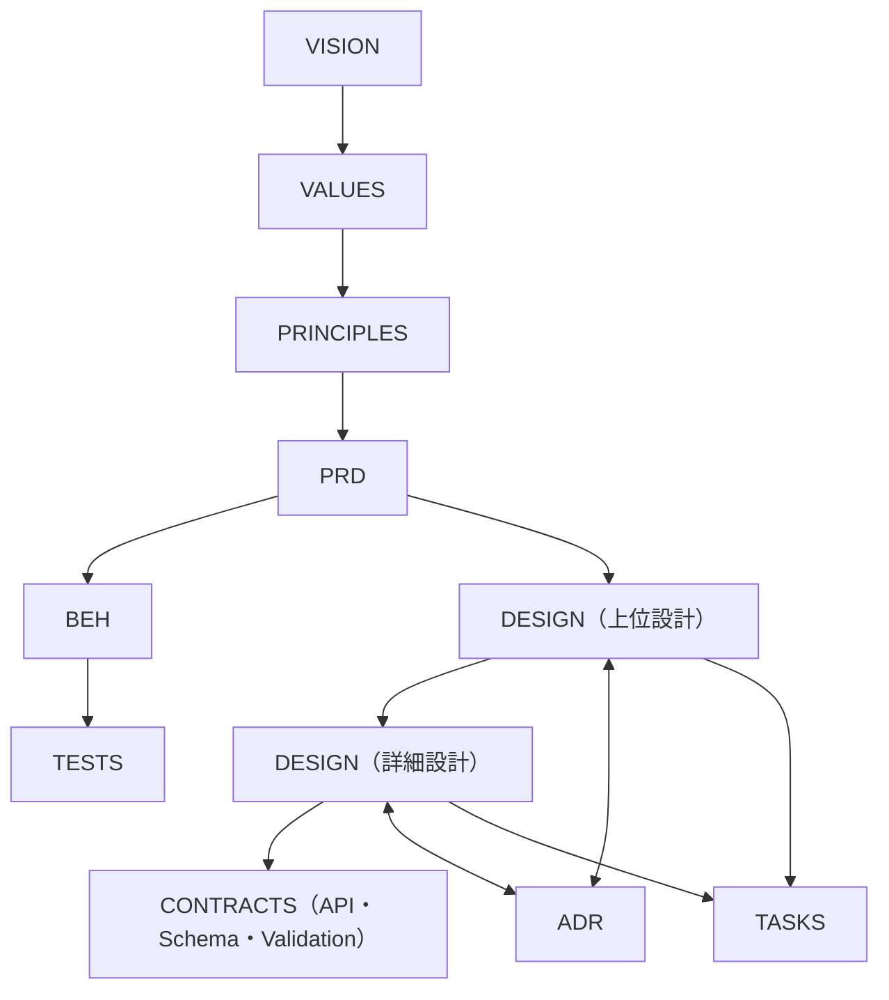

# DIRECTORY_GUIDE.md  
ドキュメント構造ガイド（Directory Structure Guide）

この文書は、プロジェクトの **ドキュメント配置・命名・階層構成** を定義します。  
目的は、プロダクト規模を問わず一貫した構造で PRD・BEH・DSG・ADR・TASK などを管理し、  
設計・運用・CI 自動化を容易にすることです。

---

## ディレクトリ構成（正式版）

以下の `{FEATURE}` / `{SUB}` / `{DOMAIN}` / `{SEQ}` / `{VERSION}` / `{DATE}` などは変数です。  
この構成は **すべてのプロジェクトに共通のベース** として利用できます。

```
docs/
  philosophy/
    vision-and-core-values.md
    product-principles.md

  product/
    features/
      README.md
      _template-prd.md
      _template-beh.md
      {FEATURE}/
        PRD-{FEATURE}.md
        SUB-PRD-{SUB}.md
        BEH-{FEATURE}.md
        BEH-{FEATURE}-{SUB}.md
      {FEATURE2}/
        PRD-{FEATURE2}.md
        BEH-{FEATURE2}.md

    architecture/
      design/
        README.md
        _template-dsg.md
        {FEATURE}/
          DSG-{FEATURE}.md
          DSG-{FEATURE}-{SUB}.md
          contracts/
            {SUB}-openapi.yaml
            {SUB}-schema.json
            {SUB}-validation.md
            {SUB}-events.md
        {FEATURE2}/
          DSG-{FEATURE2}.md
          contracts/
            {SUB2}-openapi.yaml

      contracts/                          # 共有 or 外部公開の契約のみ昇格
        README.md
        {DOMAIN}/
          {DOMAIN}-openapi.yaml
          {DOMAIN}-schema.json

      adr/
        README.md
        _template-adr.md
        ADR-{SEQ}-{topic}.md              # 機能横断。frontmatterで feature をタグ付け

    tasks/
      README.md
      _template-task.md
      TSK-{FEATURE}.md

  ops/
    runbook-{topic}.md
CHANGELOG.md
```

---

## ディレクトリの意味

| セクション | 説明 |
|-------------|------|
| **philosophy/** | VISION・CORE VALUES・PRINCIPLES など、全プロダクト共通の理念群 |
| **product/features/** | 機能単位の要件 (PRD) と振る舞い仕様 (BEH) |
| **product/architecture/design/** | 機能ごとの設計と契約 (DSG / contracts) |
| **product/architecture/contracts/** | 複数機能で共用される API / Schema / Validation 定義 |
| **product/architecture/adr/** | 設計判断の履歴 (ADR) |
| **product/tasks/** | 実装・テスト・運用タスクの管理 |
| **ops/** | 運用 Runbook・障害対応手順など |
| **CHANGELOG.md** | プロダクト全体の変更履歴 |

---

## 命名規約

| 種別 | 命名規則 | 例 |
|------|-----------|----|
| メインPRD | `PRD-{FEATURE}.md` | `PRD-AUTH.md` |
| サブPRD | `SUB-PRD-{SUB}.md` | `SUB-PRD-LOGIN.md` |
| メインBEH | `BEH-{FEATURE}.md` | `BEH-AUTH.md` |
| サブBEH | `BEH-{FEATURE}-{SUB}.md` | `BEH-AUTH-LOGIN.md` |
| 上位設計 | `DSG-{FEATURE}.md` | `DSG-AUTH.md` |
| 詳細設計 | `DSG-{FEATURE}-{SUB}.md` | `DSG-AUTH-LOGIN.md` |
| 契約定義 | `{SUB}-openapi.yaml` / `{SUB}-schema.json` | `LOGIN-openapi.yaml` |
| ADR | `ADR-{SEQ}-{topic}.md` | `ADR-0001-token-expiry.md` |
| タスク | `TSK-{FEATURE}.md` | `TSK-AUTH.md` |
| Runbook | `runbook-{topic}.md` | `runbook-deploy.md` |

---

## 配置ルール

- 各 `{FEATURE}` ディレクトリが **機能の最小単位**。  
  サブ機能 `{SUB}` は 1階層まで許容するが、それ以上は再編成が必要。  
- PRD ↔ BEH は 1:1、PRD ↔ DSG は 1:多。  
- ADR は共通ディレクトリに集約し、frontmatter に `feature` タグで関連付ける。  
- `contracts/` は原則として設計フォルダに同居。  
  ただし複数機能で共有・外部公開する契約は `architecture/contracts/` に昇格。  
- `README.md` は各主要フォルダの目的・配置ルールを記述する（コードコメントの代替）。  

---

## Frontmatter 共通仕様

```yaml
---
id: {DOC-TYPE}-{IDENTIFIER}
type: {prd|behavior|design|adr|task|foundation}
feature: {FEATURE}
subfeature: {SUB?}
parent: {PARENT_ID?}
related: [{RELATED_IDs}]
purpose: >
  （この文書の目的）
status: {draft|active|deprecated}
version: {VERSION}
owners: ["@team-{FEATURE}"]
last_updated: "{DATE}"
---
```

> ※ `purpose` は必須。  
>  CI（doc-guard）で親 purpose との整合性を LLM により検証します。

---

## 階層間の依存関係（Mermaid）



---

## 運用指針（構造レベル）

- 構造変更（例：FEATUREの昇格）は Pull Request で必ず議論・レビューする。  
- 階層追加は **ルートガイドラインに追記してから実施**。  
- `_template-*.md` は更新後、`dox-kit scaffold` コマンドで再生成できる状態を保つ。  
- `features/_index.md` や `_graph.mmd` などの自動生成ファイルは CI によって管理される。  
- 全構造は **README（思想）** と **DIRECTORY_GUIDE（構造）** の二層で統制する。  

---

> **目的:**  
> どのプロジェクトでも同じルールで「目的・体験・設計・判断・実装」を整然と管理できるようにする。  
> これが dox-kit の最小構成単位であり、ドキュメント駆動開発の出発点である。

