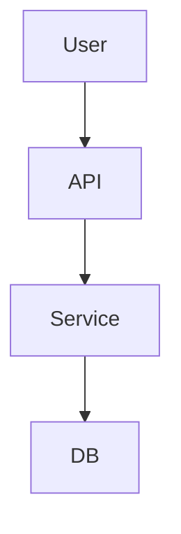

# DSG-{FEATURE}

## Background
（PRD / BEH で定義された目的をどのように実現するかを簡潔に記述）

## Goals
- （この設計が達成すべき状態を箇条書き）

## Overview
- 機能構成、主要フロー、データの流れ、責務の分離方針などを記述
- 図示する場合は Mermaid または PlantUML を推奨

## Structure
- 主なコンポーネント・モジュールの一覧
- データモデルやリレーションの概要
- 内部・外部依存の明示（contracts参照）

## Contracts
- APIエンドポイント、スキーマ、イベント仕様の要約
- 詳細は `contracts/` 以下のファイルを参照

## Non-Functional Aspects
- セキュリティ / パフォーマンス / 拡張性 / 運用性 など、非機能要件に関わる設計方針

## Future Considerations
- 今後検討が必要な論点、未確定の設計判断など

---

> **Note:**  
> 設計書は「仕様の再現性」を目的とする。  
> コードの実装方針は別途 `tasks/` や `ADR/` に委ねる。

